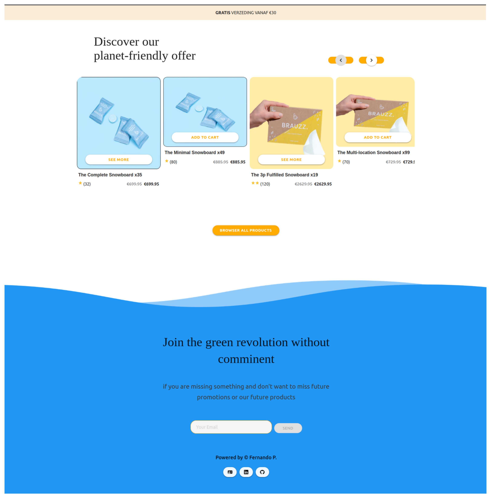

# Stack 
Angular 15.1.5.

materialize css 1.0.0 

## Development server
Run `git clone https://github.com/fernanj2323/graditest.git`

Run `npm install`

Run `ng serve`

Navigate to `http://localhost:4200/`

## Production Server 
Run `git clone https://github.com/fernanj2323/graditest.git`

Run `docker build -f DOCKERFILE -t graditest .`

Run `docker-compose up`  

# Gradiweb tecnical test 

